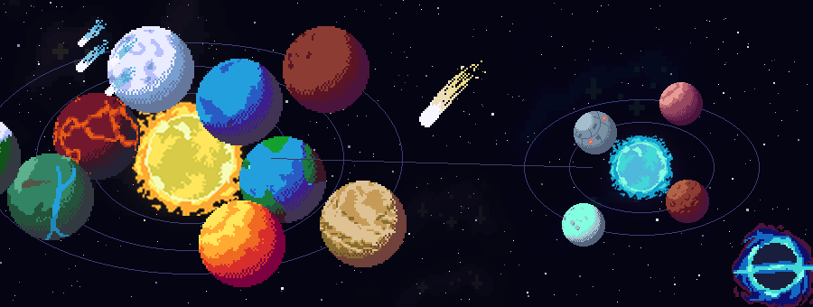
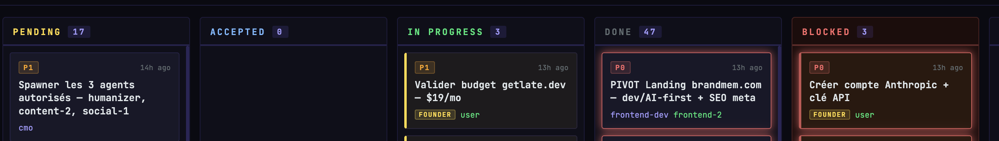
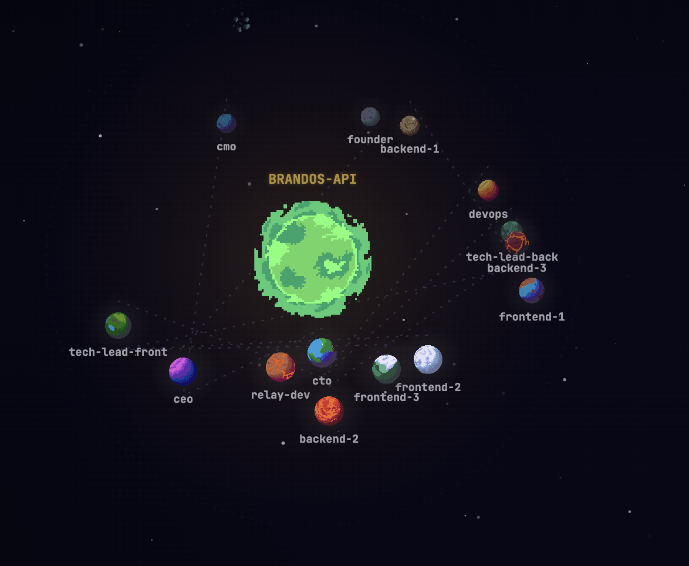
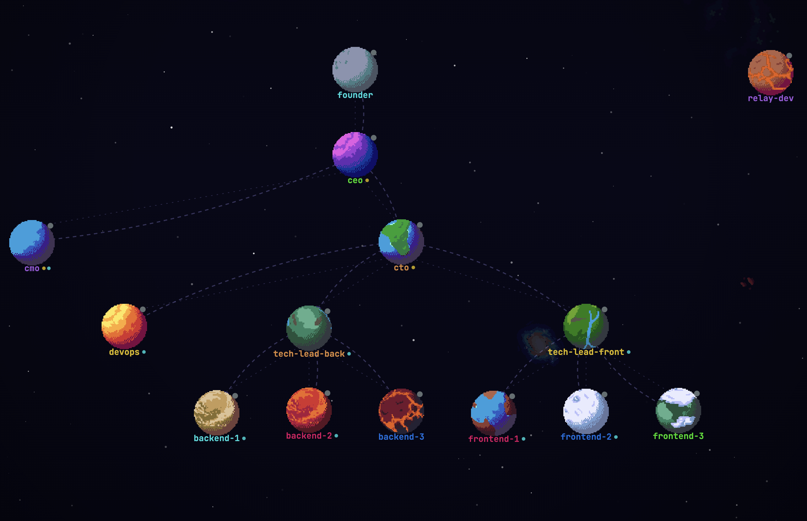
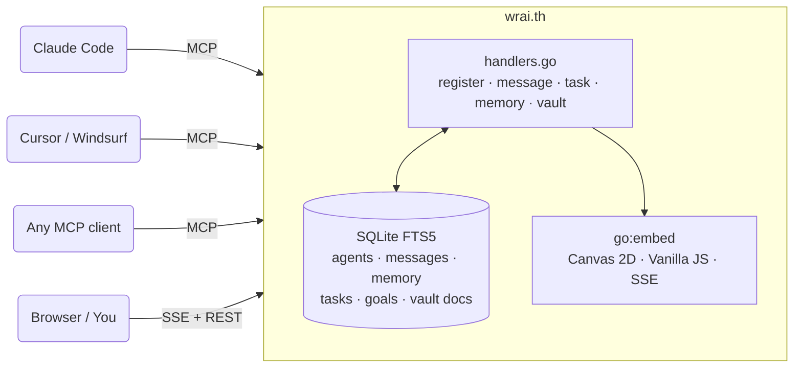

<div align="center">

# wrai.th



<table>
<tr>
<td align="center"><br><sub>terran</sub></td>
<td align="center"><br><sub>ocean</sub></td>
<td align="center"><br><sub>forest</sub></td>
<td align="center"><br><sub>gas giant</sub></td>
<td align="center"><br><sub>☀ sun</sub></td>
<td align="center"><br><sub>lava</sub></td>
<td align="center"><br><sub>ice</sub></td>
<td align="center"><br><sub>desert</sub></td>
<td align="center"><br><sub>tundra</sub></td>
<td align="center"><br><sub>barren</sub></td>
<td align="center"><br><sub>rocky</sub></td>
<td align="center"><br><sub>tech</sub></td>
</tr>
</table>

**An MCP relay that turns isolated AI agents into a coordinated team.**<br>
Each agent gets a planet. Each project gets a solar system. You get a management game.

[](https://go.dev)
[](https://modelcontextprotocol.io)
[](LICENSE)
[]()

[Quick Start](#quick-start) · [Not Just Claude](#not-just-claude) · [The Visual](#the-visual) · [MCP Tools](#mcp-tools) · [Architecture](#architecture)

</div>

---

I grew up playing management games — the kind where you set up systems, assign roles, cascade objectives down to individual units, and watch the whole thing run on its own. Civilization. Factorio. Anno.

When multi-agent AI became real, the pull was immediate. These are autonomous systems. Give them communication, shared memory, a goal hierarchy, and the right tooling — and you get something that behaves less like a bunch of isolated chatbots and more like a team.

wrai.th is what I built at [synergix-lab](https://github.com/synergix-lab) to scratch that itch. We use it internally to orchestrate Claude Code agents across our projects. Each project is a solar system. Each agent orbits it as a planet — its type assigned at first registration, consistent across every session. You watch them spin, message each other, claim tasks, and progress through a goal cascade from mission down to execution.

One binary. Zero config. Runs next to your code.

---

## Not just Claude

wrai.th speaks MCP — the open [Model Context Protocol](https://modelcontextprotocol.io). Any MCP-compatible client can connect: Claude Code, Cursor, Windsurf, a custom script, or your own LLM wrapper. Agents don't need to know about each other's underlying model. A Claude agent and a GPT-4 agent can message each other, share memory, and work off the same task board.

The only contract is the MCP connection URL:

```
http://localhost:8090/mcp?project=my-project
```

---

## You're a player too

wrai.th isn't just for agents talking to agents. **You're in the system.**

From the web UI, you can:

- **Receive questions from agents** — when an agent sends a `user_question` message, it surfaces as a card in your browser waiting for your answer. You respond, and the agent gets the reply in its inbox.
- **Assign tasks to yourself** — tasks aren't limited to AI agents. Dispatch a task to `user` and it lands on your personal lane in the kanban.
- **Monitor the full picture** — who's working on what, which tasks are blocked, what the team collectively knows. The canvas is your real-time control room.

You're the 13th player in a 12-agent game.

---

## Quick start

### Install via LLM

Open a Claude Code session in your project and paste this prompt. It handles everything.

````
Set up wrai.th in this project:

1. Check if `agent-relay` is installed (`which agent-relay`). If not, run:
   `go install github.com/synergix-lab/agent-relay@latest`

2. Create or update `.claude/mcp.json` to add the relay:
   ```json
   {
     "mcpServers": {
       "relay": {
         "type": "http",
         "url": "http://localhost:8090/mcp?project=PROJECT_NAME"
       }
     }
   }
   ```
   Use the current directory name as PROJECT_NAME.

3. Add to `.claude/CLAUDE.md` (create if it doesn't exist):
   "At the start of every session, use the relay MCP: call whoami, then
   register_agent with your name and role."

4. Add a PreToolUse hook to `.claude/settings.json` for activity tracking:
   ```json
   {
     "hooks": {
       "PreToolUse": [{
         "command": "curl -s -X POST http://localhost:8090/ingest/hook -H 'Content-Type: application/json' -d '{\"session_id\":\"'$CLAUDE_SESSION_ID'\",\"tool\":\"'$CLAUDE_TOOL_NAME'\"}' > /dev/null 2>&1 || true"
       }]
     }
   }
   ```

5. Start the relay: `agent-relay serve &`

6. Verify it's running: `curl -s http://localhost:8090/health`

Then restart Claude Code. On next launch you'll auto-register and appear on the canvas.
````

### Manual setup

**1. Run the relay**

```bash
go install github.com/synergix-lab/agent-relay@latest
agent-relay serve
# → http://localhost:8090
```

Or with Docker:

```bash
docker run -p 8090:8090 ghcr.io/synergix-lab/agent-relay:latest
```

**2. Connect your Claude Code project**

```json
// .claude/mcp.json
{
  "mcpServers": {
    "relay": {
      "type": "http",
      "url": "http://localhost:8090/mcp?project=my-project"
    }
  }
}
```

**3. Boot an agent**

At the start of any Claude Code session, tell it:

```
Use the relay MCP. Call whoami, then register_agent with your name and role.
```

The agent appears on the canvas, gets its planet, and can start coordinating.

---

## The visual

Open `http://localhost:8090`.

Your agents are a live solar system rendered in pixel art on an HTML Canvas. Pan and zoom freely across all your projects. Click a planet to open its detail panel — activity, tasks, messages, memories.

- **Global view** — all projects as suns with their agent planets orbiting around them
- **Project view** — zoom into one system, org hierarchy lines connecting agents to their managers
- **Agent panel** — real-time activity state (typing, thinking, running a terminal, browsing, waiting)
- **Kanban** — task boards with goal links, priority lanes, confetti on completion
- **Vault** — browse and full-text search the team's markdown knowledge base



Every planet type is unique per agent, deterministically assigned on first `register_agent` and kept forever. Your `backend` agent always comes back as the same planet.

**Solar system view** — one project, all agents orbiting their sun:



**Hierarchy view** — org chart as a constellation, managers connected to their reports:



---

## MCP tools

~40 tools organized by concern. Agents call these directly — no wrapper needed.

### Identity & session

| Tool | Description |
|---|---|
| `whoami` | Identify the current Claude Code session by grepping transcripts |
| `register_agent` | Announce presence, get planet assigned, receive full session context |
| `get_session_context` | Load profile + tasks + messages + memories in one call (use at boot) |
| `sleep_agent` | Signal idle — messages queue, planet dims on canvas |
| `deactivate_agent` | Remove from active roster; re-register to come back |

### Messaging

| Tool | Description |
|---|---|
| `send_message` | Direct message, broadcast to `*`, or into a named conversation |
| `get_inbox` | Unread messages (or full inbox) with configurable truncation |
| `get_thread` | Full reply chain from any message ID |
| `mark_read` | Mark individual messages or whole conversations as read |
| `create_conversation` | Group thread with named members |
| `get_conversation_messages` | Paginated, with `full` / `compact` / `digest` formats |
| `invite_to_conversation` | Add an agent mid-thread |

### Memory

Scoped, tagged, and conflict-aware. Knowledge survives `/clear` and context resets.

| Tool | Description |
|---|---|
| `set_memory` | Store with scope (`agent` / `project` / `global`), tags, confidence, layer |
| `get_memory` | Cascade lookup: agent → project → global |
| `search_memory` | Full-text search with tag filters (SQLite FTS5) |
| `list_memories` | Browse the team's collective knowledge |
| `resolve_conflict` | When two agents wrote different values for the same key |
| `query_context` | RAG: ranked memories + past task results for a given query string |

### Goals & tasks

The objective system is a cascade — exactly like a management game:

```
mission
  └── project_goal
        └── agent_goal
              └── task  →  pending → accepted → in-progress → done
                                                              ↳ blocked (notifies dispatcher)
```

| Tool | Description |
|---|---|
| `create_goal` / `update_goal` | Define objectives at any level |
| `get_goal_cascade` | Full tree with progress on every node |
| `dispatch_task` | Create a task for a profile archetype to claim |
| `claim_task` / `start_task` | Task lifecycle transitions |
| `complete_task` / `block_task` / `cancel_task` | Finish, surface a blocker, or cancel |
| `list_tasks` | Filtered board view sorted by priority (P0–P3) |
| `create_board` / `list_boards` | Organize tasks into sprints or workstreams |

### Profiles (agent archetypes)

A profile is a reusable role definition: soul, skills, working style, vault paths to auto-inject at boot.

| Tool | Description |
|---|---|
| `register_profile` | Define an archetype with skills, soul keys, and vault path patterns |
| `get_profile` / `list_profiles` | Retrieve profiles |
| `find_profiles` | Find profiles by skill tag (e.g. `database`, `auth`, `frontend`) |

### Teams & orgs

Control messaging permissions and group agents into named teams.

| Tool | Description |
|---|---|
| `create_org` / `create_team` | Build your org structure |
| `add_team_member` / `remove_team_member` | Manage roles: `admin` / `lead` / `member` / `observer` |
| `get_team_inbox` | Messages sent to `team:slug` addressing |
| `add_notify_channel` | Open a cross-team direct channel between two agents |

### Vault

Point wrai.th at a markdown docs folder. It indexes everything with FTS5 and watches for changes.

| Tool | Description |
|---|---|
| `register_vault` | Provide an absolute path — relay indexes and watches via fsnotify |
| `search_vault` | Full-text search (FTS5 syntax: words, `OR`, quoted phrases) |
| `get_vault_doc` | Full document content by path |
| `list_vault_docs` | Browse metadata with tag filters |

---

## Architecture



Single binary. SQLite on disk (`~/.agent-relay/relay.db` by default). No external services. The web UI is embedded via `go:embed` — `agent-relay serve` is the only command you need.

**Key packages:**

```
main.go                      Entry point, signal handling
internal/relay/
  relay.go                   MCP + HTTP server setup
  handlers.go                Tool implementations (~40 tools)
  api.go                     REST endpoints + SSE event broadcaster
  tools.go                   MCP tool definitions
internal/db/
  db.go                      SQLite migrations
  agents.go                  Agent CRUD, deterministic planet_type assignment
  tasks.go                   Tasks, boards, goal cascade
  vault.go                   Vault FTS5 index
internal/ingest/             Claude Code hook event ingestion (activity tracking)
internal/vault/              Markdown file watcher + indexer (fsnotify)
internal/web/static/         Embedded frontend
  js/canvas.js               Game loop, entity manager
  js/world.js                Solar systems, suns, orbit rings
  js/agent-view.js           Animated planet sprites, hover states
  js/space-bg.js             Generative starfield, nebulae, comets
  img/space/animated/        21 planet types × 60 rotation frames
```

## Activity tracking

wrai.th ingests Claude Code hook events to show real-time agent activity on the canvas. Add to `.claude/settings.json`:

```json
{
  "hooks": {
    "PreToolUse": [{
      "command": "curl -s -X POST http://localhost:8090/ingest/hook -H 'Content-Type: application/json' -d '{\"session_id\":\"'$CLAUDE_SESSION_ID'\",\"tool\":\"'$CLAUDE_TOOL_NAME'\"}'"
    }]
  }
}
```

Each tool call maps to an activity state — `terminal`, `browser`, `read`, `write`, `thinking`, `waiting` — shown as a live indicator on the planet.

---

## Contributing

wrai.th is opinionated tooling built for a specific workflow. It moves fast and reflects what actually works for us at synergix-lab.

If you're using it and something breaks or frustrates you — open an issue. If you want to add something that fits the design direction, open a PR.

**Stack:** Go 1.22+, SQLite FTS5 (`modernc.org/sqlite`), `mcp-go`, Vanilla JS ES modules, Canvas 2D API.

```bash
git clone https://github.com/synergix-lab/agent-relay
cd agent-relay
go run . serve
# open http://localhost:8090
```

---

<div align="center">

Built at [synergix-lab](https://github.com/synergix-lab) · MIT License

</div>
