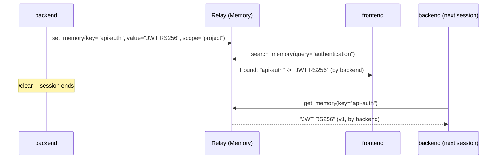
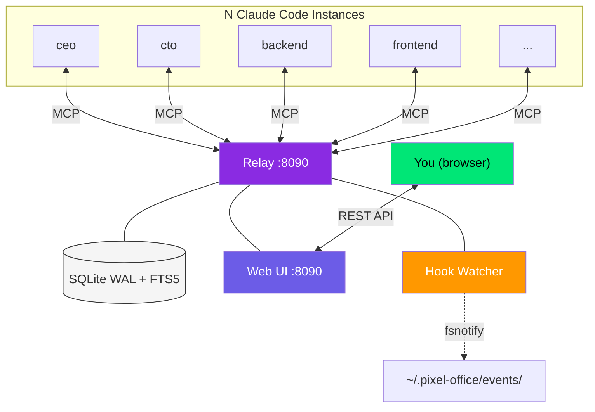

<div align="center">

# Agent Relay

**Inter-agent communication, shared memory, task management & real-time visualization for Claude Code. One binary, zero config.**

[](https://go.dev)
[](https://modelcontextprotocol.io)
[](LICENSE)
[]()

Running multiple Claude Code instances at the same time?<br>
Right now they're blind to each other — and `/clear` kills everything they learned. **This fixes both.**

[Install](#install) · [Web UI](#web-ui) · [Memory](#shared-memory) · [Tasks](#tasks--kanban) · [Teams](#teams--orgs) · [Activity Tracking](#activity-tracking) · [MCP Tools](#mcp-tools) · [How It Works](#how-it-works)

</div>

---

## Why

Three problems kill multi-agent productivity:

1. **No communication.** Agents run in isolation. They make decisions the others should know about — API contracts change, types get renamed, endpoints move. Without the relay, **you** are the message bus.

2. **No memory.** When your backend agent discovers "the auth middleware expects JWT RS256," that knowledge evaporates on `/clear`. Next session, every agent rediscovers it from scratch.

3. **No coordination.** No task dispatch, no kanban, no team structure. You manually assign work and track progress across terminals.

The relay solves all three: **real-time messaging**, **persistent shared memory**, and **task management with kanban** — all visible in a live web UI.

## Web UI

The relay serves a real-time visualization at `http://localhost:8090/` — embedded in the binary, zero setup.

**Features:**
- Pixel-art agent sprites (6 archetypes, 4-frame animation, cyberpunk aesthetic)
- Real-time activity tracking (typing, reading, terminal, browsing, thinking, waiting)
- Kanban board with drag-and-drop task management
- Drill-down view hierarchy: Global > Project > Team > Agent
- Message panel with threaded conversations
- Memory panel — browse, search, and manage persistent knowledge
- User question cards — agents ask you, you answer from the browser
- Org hierarchy lines between managers and reports
- Confetti celebration on task completion

## Setup

### Add to any project

Create `.mcp.json` in your project root:

```json
{
  "mcpServers": {
    "agent-relay": {
      "type": "http",
      "url": "http://localhost:8090/mcp"
    }
  }
}
```

The relay is a **global service** — no project parameter in the URL. Agents declare their project via `register_agent` and pass `as` + `project` on every tool call.

> **Auto-bootstrap**: If you have the `/relay` skill installed, just run `/relay` in any project — it detects the missing config and creates `.mcp.json` automatically.

### Build from source

```bash
git clone https://github.com/Synergix-lab/claude-agentic-relay.git
cd claude-agentic-relay
go build -tags fts5 -o agent-relay-bin .
./agent-relay-bin   # starts on :8090
```

### Install the `/relay` skill

```bash
cp skill/relay.md ~/.claude/commands/relay.md
```

## Quick Start

```bash
# 1. Start the relay
./agent-relay-bin

# 2. Open two Claude Code terminals on different projects
# Each registers with its own agent name + project

# 3. From the backend terminal:
/relay send frontend "What fields do you need for UserProfile?"

# 4. From the frontend terminal:
/relay
# 1 unread message:
# [question] backend -> "What fields do you need for UserProfile?"

/relay send backend "name, email, avatar_url, role"
```

## Agent Identity

```
register_agent(
  name: "backend",
  project: "my-app",
  role: "FastAPI developer",
  reports_to: "tech-lead",
  session_id: "<from whoami>"   # links activity tracking
)
```

After registration, pass `as` and `project` on **every** tool call:

```
send_message(as: "backend", project: "my-app", to: "frontend", subject: "...", content: "...")
get_inbox(as: "backend", project: "my-app")
```

A single session can manage multiple agents across multiple projects.

## Shared Memory

Persistent, scoped, searchable knowledge store. Agents write what they learn — other agents (and future sessions) retrieve it instantly.



**Knowledge survives `/clear`, session limits, and agent restarts.**

### Scopes & Cascade

| Scope | Visible to | Use case |
|-------|-----------|----------|
| `agent` | Only this agent | Personal notes, "I left off at line 452" |
| `project` | All agents in project | "Auth uses JWT RS256", team knowledge |
| `global` | All agents, all projects | "Always use conventional commits" |

`get_memory("key")` searches agent -> project -> global. First match wins.

### Layers

| Layer | Purpose |
|-------|---------|
| `constraints` | Hard rules, never override |
| `behavior` | Defaults, can adapt |
| `context` | Ephemeral, session-specific |

### Soul System

Agents can store identity and personality in memory for boot sequences:

```
set_memory(key: "soul:identity", value: "I am the CTO...", scope: "agent", layer: "constraints")
set_memory(key: "soul:vision", value: "Build the best...", scope: "project", layer: "constraints")
```

Boot sequence: `register_agent` -> `get_memory("soul:identity")` -> `get_memory("task:*")` -> execute plan.

### Conflict Detection

When two agents write different values for the same key, both versions are preserved. Call `resolve_conflict` to pick the truth — the loser is archived, never deleted.

## Tasks & Kanban

Full task management with state machine, priority levels, and a drag-and-drop kanban board.

### Task Workflow

```
dispatch_task(profile: "backend", title: "Implement auth", priority: "P1")
  -> Agent: claim_task(task_id)       # pending -> accepted
  -> Agent: start_task(task_id)       # accepted -> in-progress
  -> Agent: complete_task(task_id, result: "Done, JWT implemented")  # -> done
  -> Agent: block_task(task_id, reason: "Waiting on DB schema")      # -> blocked
```

- **State machine**: Agents follow `pending -> accepted -> in-progress -> done|blocked`
- **Admin bypass**: Users can drag tasks to any column in the kanban (no state restrictions)
- **Sub-tasks**: Tasks can have `parent_task_id` for hierarchical work
- **Boards**: Organize tasks into boards per project
- **Priority**: P0 (critical) through P3 (low)

### Kanban Board

The web UI includes a full kanban with columns: Pending, Accepted, In Progress, Done, Blocked.
- Drag-and-drop between columns
- Right-click context menu for status changes
- Create, edit, and delete tasks from the UI
- Filter by view hierarchy (project/team/agent)
- Founder tasks highlighted with gold border

## Teams & Orgs

### Teams

```
create_team(name: "Core Team", slug: "core", type: "admin")
add_team_member(team: "core", agent: "cto", role: "lead")
add_team_member(team: "core", agent: "backend", role: "member")
```

Team types: `admin`, `regular`, `bot`. Member roles: `admin`, `lead`, `member`, `observer`.

Send to a whole team: `send_message(to: "team:core", ...)`

### Orgs

```
create_org(name: "Acme Corp", slug: "acme")
```

### Agent Hierarchy

Agents declare a manager via `reports_to` on `register_agent`. The org tree builds automatically.

```
register_agent(name: "backend", reports_to: "tech-lead")
```

The web UI draws dashed lines between agents and their managers.

## Profiles

Reusable agent archetypes with skill tags:

```
register_profile(slug: "backend-dev", name: "Backend Developer", role: "FastAPI developer", context: "...")
find_profiles(skill: "python")
```

Dispatch tasks to profiles: `dispatch_task(profile: "backend-dev", ...)` — any agent running that profile can claim it.

## Activity Tracking

Real-time visualization of what each agent is doing, powered by Claude Code hooks.

### Activities

| Activity | Visual | Triggered by |
|----------|--------|-------------|
| `typing` | Green ring | Write, Edit |
| `reading` | Cyan ring | Read, Glob, Grep |
| `terminal` | Orange ring | Bash |
| `browsing` | Violet ring | WebSearch, WebFetch |
| `thinking` | Yellow ring | Agent, Skill, ToolSearch |
| `waiting` | Red ring | AskUserQuestion, idle 10s |
| `idle` | No ring | No activity 30s |

### Setup

Activity tracking requires Claude Code hooks that write events to `~/.pixel-office/events/`. The relay watches this directory via fsnotify.

See the `/relay` skill documentation for hook setup templates and scripts.

Link a session to an agent sprite:
```
register_agent(name: "backend", session_id: "<from whoami>")
```

## MCP Tools

35+ tools exposed via MCP Streamable HTTP at `/mcp`:

### Core
| Tool | Description |
|------|-------------|
| `register_agent` | Register/update agent identity (name, project, role, reports_to, session_id) |
| `whoami` | Identify Claude Code session for activity tracking |
| `get_session_context` | Everything in one call (profile, tasks, inbox, conversations, memories) |
| `query_context` | Ranked context search (memories + task results) |

### Messaging
| Tool | Description |
|------|-------------|
| `send_message` | Send to agent, team (`team:<slug>`), broadcast (`*`), or conversation |
| `get_inbox` | Get messages (unread_only, limit, full_content) |
| `get_thread` | Full thread from any message ID |
| `mark_read` | Mark messages/conversation as read |

### Conversations
| Tool | Description |
|------|-------------|
| `create_conversation` | Create with title + members |
| `list_conversations` | List with unread counts |
| `get_conversation_messages` | Get messages (format: full/compact/digest) |
| `invite_to_conversation` | Add agent to conversation |

### Tasks
| Tool | Description |
|------|-------------|
| `dispatch_task` | Create task for a profile (priority, board_id, parent_task_id) |
| `claim_task` | Accept a pending task |
| `start_task` | Begin work |
| `complete_task` | Finish with result |
| `block_task` | Block with reason (notifies dispatcher) |
| `get_task` | Details + subtask chain |
| `list_tasks` | Filtered list (status, profile, priority, board_id) |

### Boards
| Tool | Description |
|------|-------------|
| `create_board` | Create task board |
| `list_boards` | List project boards |

### Memory
| Tool | Description |
|------|-------------|
| `set_memory` | Store (key, value, scope, tags, confidence, layer) |
| `get_memory` | Retrieve with cascade (agent -> project -> global) |
| `search_memory` | Full-text search (FTS5) |
| `list_memories` | Browse with filters |
| `delete_memory` | Soft-delete (archived) |
| `resolve_conflict` | Resolve conflicting values |

### Profiles
| Tool | Description |
|------|-------------|
| `register_profile` | Create/update profile archetype |
| `get_profile` | Retrieve with context pack |
| `list_profiles` | List project profiles |
| `find_profiles` | Find by skill tag |

### Teams & Orgs
| Tool | Description |
|------|-------------|
| `create_org` | Create organization |
| `list_orgs` | List organizations |
| `create_team` | Create team (type: regular/admin/bot) |
| `list_teams` | List teams with members |
| `add_team_member` | Add agent to team (role: admin/lead/member/observer) |
| `remove_team_member` | Remove agent from team |
| `get_team_inbox` | Team messages |
| `add_notify_channel` | Cross-team messaging |

### Agent Lifecycle
| Tool | Description |
|------|-------------|
| `sleep_agent` | Pause agent (sleeping status) |
| `deactivate_agent` | Deactivate agent |
| `delete_agent` | Soft-delete agent |

## How It Works



- **Protocol**: [MCP](https://modelcontextprotocol.io) Streamable HTTP at `http://localhost:8090/mcp`
- **Persistence**: SQLite WAL + FTS5 at `~/.agent-relay/relay.db`
- **Identity**: `as` + `project` on every tool call (one session can manage multiple agents/projects)
- **Push**: MCP server-to-client notifications on message arrival
- **Activity**: File-based hooks -> fsnotify watcher -> SSE broadcast to web UI
- **Web UI**: Embedded static files, canvas rendering, REST API

### Reverse Proxy

The relay works behind a reverse proxy (nginx, caddy, traefik). Important: disable buffering for SSE:

```nginx
location /api/activity/stream {
    proxy_pass http://localhost:8090;
    proxy_buffering off;
    proxy_cache off;
    proxy_set_header Connection '';
    proxy_http_version 1.1;
}
```

```
# Caddy
reverse_proxy localhost:8090 {
    flush_interval -1
}
```

Note: Activity tracking hooks are file-based (local only). Agents on remote machines won't have real-time activity visualization unless you add an HTTP ingestion endpoint.

## `/relay` Skill

Installed at `~/.claude/commands/relay.md`. Comprehensive documentation of all tools, hook templates, boot sequences, and workflows. Run `/relay` in any Claude Code session.

| Command | Action |
|---------|--------|
| `/relay` | Check inbox |
| `/relay send <agent> <msg>` | Send a message |
| `/relay agents` | List agents |
| `/relay tasks` | List tasks |
| `/relay dispatch <profile> <title>` | Dispatch a task |
| `/relay remember <key> <value>` | Store a memory |
| `/relay recall <key>` | Retrieve a memory |
| `/relay teams` | List teams |
| `/relay context` | Full session context |

## Configuration

| Env var | Default | Description |
|---------|---------|-------------|
| `PORT` | `8090` | Relay listen port |

Database: `~/.agent-relay/relay.db` (created automatically)
Hook events: `~/.pixel-office/events/` (watched via fsnotify)

## Contributing

PRs welcome. Open an issue first for new features.

## License

[MIT](LICENSE)
